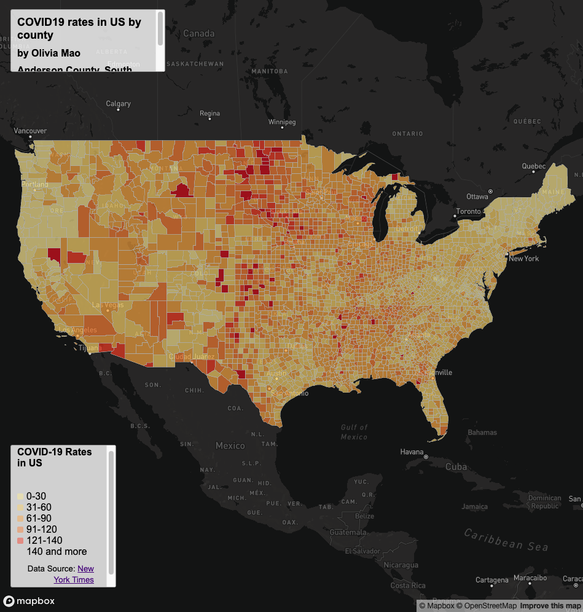
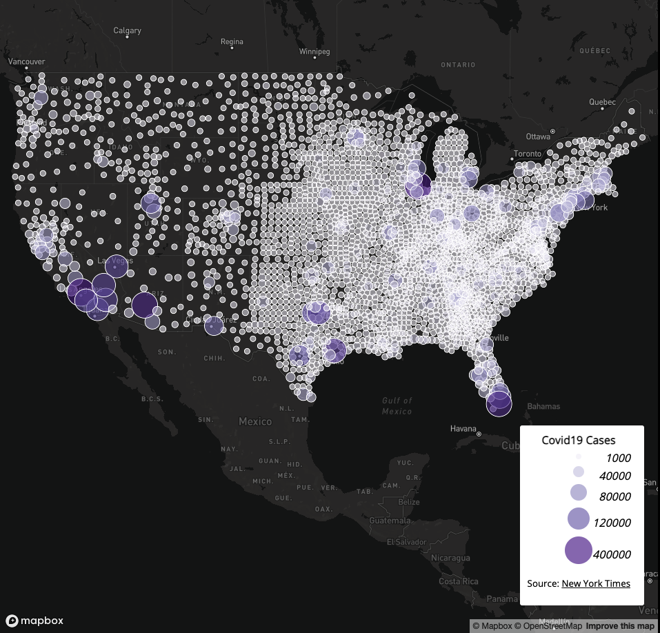

# Covid-19 Cases and Rates in the US 

## Introduction
To better visualize the Covid-19 pandemic in the US, we use a choropleth map to show the Covid-19 rates and a proportional symbol map for the Covid-19 cases in each county during 2020. 

## [Map 1](https://olithinivia.github.io/covid-in-US/map1.html): Choropleth Map of the Covid-19 rates in the US 

#### Primary Map Function
This map shows the rates of Covid-19 in each County during 2020. Hover the mouse cursor over the county to see more information about the Covid-19 rates. The information displays on the upper left window. 

## [Map 2](https://olithinivia.github.io/covid-in-US/map2.html): Proportional Symbol Map of the Covid-19 cases in the US 

#### Primary Map Function
This map shows the cases of Covid-19 in each County during 2020. Click on the dots to see more information about the Covid-19 cases in different county. The information displays in a pop-up window.

## Libraries in use
1. [Mapbox web services APIs](https://docs.mapbox.com/api/overview/)
2. [JavaScript](https://www.javascript.com/)

## Data Soucrces
1. [The New Work Times](https://github.com/nytimes/covid-19-data/blob/43d32dde2f87bd4dafbb7d23f5d9e878124018b8/live/us-counties.csv)
2. [2018 ACS 5 year estimates](https://data.census.gov/cedsci/table?g=0100000US%24050000&d=ACS%205-Year%20Estimates%20Data%20Profiles&tid=ACSDP5Y2018.DP05&hidePreview=true)
3. [The U.S. Census Bureau](https://www.census.gov/geographies/mapping-files/time-series/geo/carto-boundary-file.html)

## Credits
- [GEOG 458 Lab 3 Instruction By Prof. Bo Zhao](https://github.com/jakobzhao/geog458/tree/master/labs/lab03)
- [GitHub](https://github.com/)
- [Mapbox web services APIs](https://docs.mapbox.com/api/overview/)

## Acknowledgement 
I appreciate the help of Jiaxin Feng for creating these maps and Steven Bao for creating the lab data. 